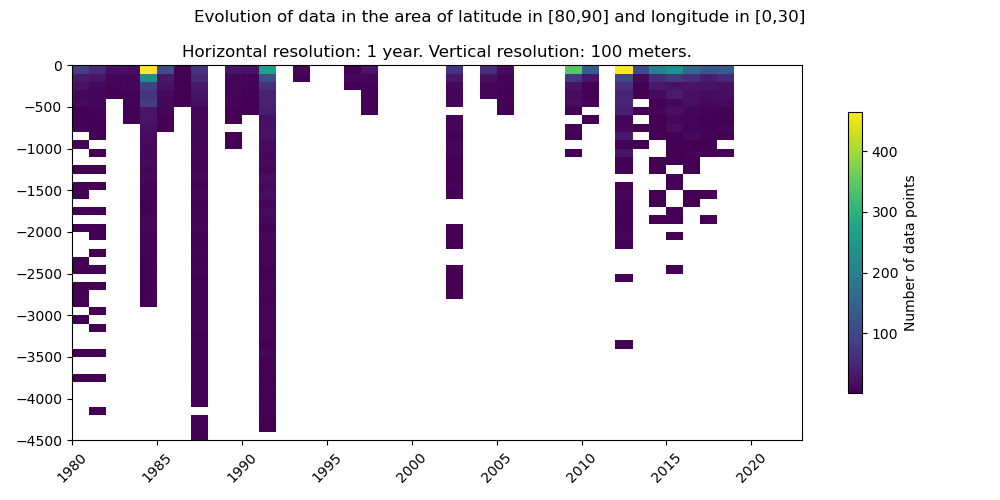

# Profile Density

`make run-plot-profile`
## Summary

This scripts reads data from a folder and plot the density profile (depth as vertical axis and date as horizontal) over a given area.

## Configuration

The configuration file for this script is `config/plot_profile.toml` (based on [`config/default_plot_profile.toml`]({{repo_blob}}/config/default/plot_profile.toml)). All the parameters and their functionality are listed below:
### **Input/Output**
??? question "LOADING_DIR"

    Directory from which to load data.

    **default**: `"bgc_data"`

    Expected type: `str`

??? question "SAVE"

    Whether to save the figure or not.

    **default**: `true`

    Expected type: `bool`

??? question "SAVING_DIR"

    Directory in which to save the figure.

    **default**: `"bgc_figs"`

    Expected type: `str`

??? question "SHOW"

    Whether to show the figure or not.

    **default**: `true`

    Expected type: `bool`
### **Data Selection**
??? question "VARIABLE"

    Variable to map. If 'all': will map density of datapoints, regardless of their variables.

    **default**: `"NTRA"`

    Expected type: `str`

??? question "DATE_MIN"

    First date to map (included).

    **default**: `"20070101"`

    Expected type: `str` (must match the `YYYYMMDD` format)

??? question "DATE_MAX"

    Last date to map (included).

    **default**: `"20201231"`

    Expected type: `str` (must match the `YYYYMMDD` format)

??? question "LATITUDE_MIN"

    Minimum latitude boundary to consider for the loaded data (included).

    **default**: `50`

    Expected type: `int or float`

??? question "LATITUDE_MAX"

    Maximum latitude boundary to consider for the loaded data (included).

    **default**: `90`

    Expected type: `int or float`

??? question "LONGITUDE_MIN"

    Minimum longitude boundary to consider for the loaded data (included).

    **default**: `-180`

    Expected type: `int or float`

??? question "LONGITUDE_MAX"

    Maximum longitude boundary to consider for the loaded data (included).

    **default**: `180`

    Expected type: `int or float`

??? question "DEPTH_MIN"

    Minimum depth boundary to consider for the loaded data (included), 'nan' indicate not boundary.

    **default**: `nan`

    Expected type: `int or float`

??? question "DEPTH_MAX"

    Maximum depth boundary to consider for the loaded data (included), 'nan' indicate not boundary.

    **default**: `0`

    Expected type: `int or float`

??? question "EXPOCODES_TO_LOAD"

    Precise expocode to load alone. If empty, no discrimination on expocode will be conducted.

    **default**: `[]`

    Expected type: `list[str]`

??? question "PRIORITY"

    Providers priority list to use when removing duplicates.

    **default**: `["GLODAP_2022", "CMEMS", "ARGO", "NMDC", "CLIVAR", "IMR", "ICES"]`

    Expected type: `list[str]`
### **Plotting Options**
??? question "INTERVAL"

    Horizontal resolution of the plot. If set to `day`: will group datapoint by day. If set to `week`: will group datapoints by their week number. If set to `month`: will group datapoints by month. If set to `year`: will grou datapoints by year. If set to `custom`: will group datapoints based on a custom interval.

    **default**: `"month"`

    Expected type: `str`

??? question "CUSTOM_INTERVAL"

    If interval is 'custom', length of the custom interval (in days).

    **default**: `8`

    Expected type: `int`

??? question "DEPTH_INTERVAL"

    Vertical resolution of the figure. If of type int: vertical axis will be divided in equally sized bins of size depth_interval. If of type list[int]: vertical axis will be divided according to the given levels (levls value ar supposed to negative).

    **default**: `10`

    Expected type: `int or list[int]`
### **Others**
??? question "VERBOSE"

    Verbose value, the higher, the more informations. If set to 0 or below: no information displayed. If set to 1: minimal informations displayed. If set to 2: very complete informations displayed. If set to 3 or higher: exhaustive informations displayed.

    **default**: `2`

    Expected type: `int`
## Script Output
When executed, this script displays a density profile plot. This plot shows the depth vs date density of the data.

This is an example of what this plot could look like:

{width=750px}

Source code: [:octicons-file-code-16:]({{repo_blob}}/scripts/plot_profile.py)
